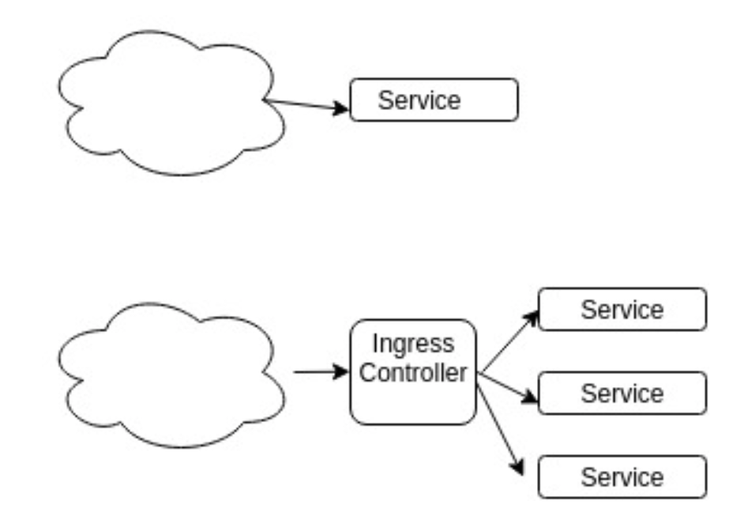

## Chapter 7: Exposing Applications

### Documentation

- kubernetes.io > Concepts > Services, Load Balancing, and Networking > [Service](https://kubernetes.io/docs/concepts/services-networking/service/)

### Notes from the Training


From: kubernetes.io > Concepts > Services, Load Balancing, and Networking > [Service](https://kubernetes.io/docs/concepts/services-networking/service/)

Create a Service with `kubectl`

```bash
kubectl expose deployment/nginx --port=80 --type=NodePort
kubectl get services
kubectl get service nginx -o yaml
```

Get the port from `Service.spec.ports.nodePort` to open `http://<publicIP>:<nodePort>/`

#### Ingress Controllers



List of Ingress Controllers:

- Nginx
- GCE
- [Traefik](https://traefik.io/)
- [HAProxy](http://www.haproxy.org/)

### Service Mesh

- [Envoy](https://www.envoyproxy.io/)
- [Istio](https://istio.io/)
- [linkerd](https://linkerd.io/2/)


